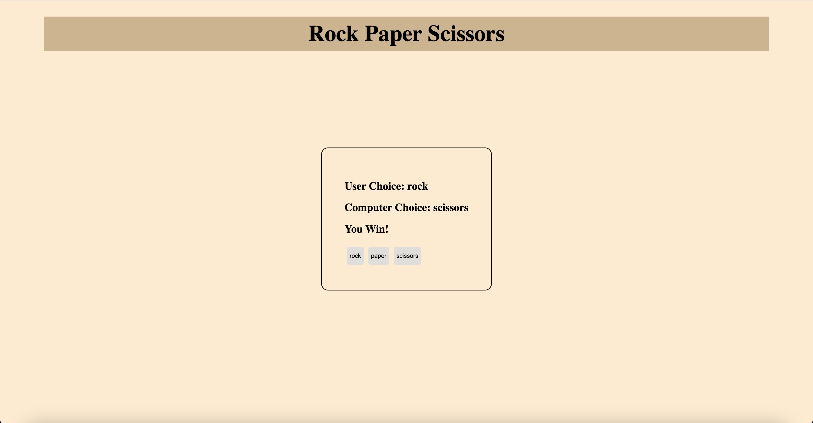

# Rock Paper Scissors
  
  ## ReadMe Description 

  This is a simple rock paper scissors game. The HTML elements are created dynamically when user selects a button they would like to press. After pressing a button, the computer will make a selection and the game will will give you a result on if it was a tie, loss, or you won.  

  ## Table of Contents: 

  * [Installation](#installation) 

  * [Contributors](#contributors) 

  * [Usage](#usage) 

  * [Tests](#tests) 

  * [Questions](#questions) 

  * [License](#license) 

  ## Name: 

  Sebastian Tischner

  ## Installation 

  No installation needed

  ## Contributors 

  Fork Repository 

  ## Usage 

  Press button to play.  

  ## Tests 

  No tests

  ## License 
 
  This project is protected by the MIT license.

  ## Questions?

  Feel free to reach out! 

  Github: [Sebascrab](https://github.com/Sebascrab) 

  Email: alexanders.tischner@outlook.com 

  
  Deployed: https://sebascrab.github.io/Rock-Paper-Scissors/

